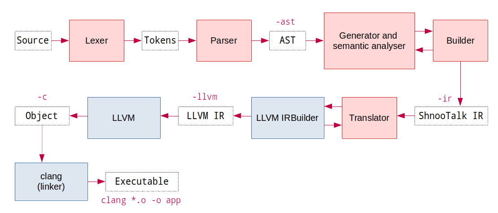

# ShnooTalk 

ShnooTalk is a programming language implemented in C++ using the LLVM compiler framework. ShnooTalk works by being compiled to a custom IR format and then translating that to LLVM IR. It is possible to run ShnooTalk on any runtime that supports the clang compiler. ShnooTalk links against standard C libraries/runtime.

See the tests directory for examples, try out the language in your browser on [ShnooTalk Playground](https://rainingcomputers.github.io/shnootalk-playground/).

🛠️ Project under construction, some things may not be fully polished yet 🛠️



## Install

### Linux (Ubuntu / Arch / Debian / Fedora / RaspberryPi 32 bit)
```
curl -sf -L https://raw.githubusercontent.com/RainingComputers/ShnooTalk/main/install.sh | sudo sh
```

### MacOS

```
brew tap rainingcomputers/shnootalk
brew install shtkc
```

### Linux AppImage

Download app image from [releases](https://github.com/RainingComputers/ShnooTalk/releases) page

### Installing from source (Ubuntu)
Download the source from latest [release](https://github.com/RainingComputers/ShnooTalk/releases)
```
sudo apt install llvm-12 llvm-12-dev
make build
sudo make install
```

### VS Code syntax highlight extension

Install the extension from [here](https://marketplace.visualstudio.com/items?itemName=RainingComputers.shnootalk-vscode) 

## Getting started

**app.shtk**
```
fn main() -> int
{
    println("Hello world")
    return 0
}
```

**Compile and run**
```
shtkc app.shtk -c
clang app.o -o app
./app
```
(You can also use gcc instead of clang)

## Running compiler tests

```
make test
```

## TODO

### Language core

*Priority*
- [x] Incomplete types and type composing of a pointer to itself
- [x] null pointer check
- [x] Direct from
- [x] make constructors
- [x] := initializer
- [x] Destructuring
- [x] Clean up packaging process
- [x] Improve error messages and module trace list
- [x] Change compiler tests to use `-icode-all`
- [x] Generic function call
- [x] Fix sizeof
- [ ] Class or struct destructors
- [ ] Pretty name for generics
- [ ] Revamp AST for type definitions
- [ ] Arrays of generic type
- [ ] extern "C" to prevent name mangling functions
- [ ] Spike static linking everything

*Backlog*
- [x] Fix bugs in the LLVM translator backend
- [x] Array return types
- [x] Fix def
- [x] IR Validator
- [x] Change IR pretty print to JSON
- [x] IR renaming and cleanup
- [x] Main function return type check
- [x] Fix `input()` and `print()` and `println()` functions
- [x] `exit()` function
- [x] Extern C functions and function imports
- [x] Node style module imports
- [x] `loop {}` syntax for looping forever
- [x] `do {} while()` loop
- [x] NaN and infinity
- [x] 01234 bug
- [x] Check limits for primitive data types
- [x] Dynamic allocation and pointers
- [x] Add `fopen()` function
- [x] Multi-line strings
- [x] Assigning conditional expressions
- [x] Setup github workflows and build for other platforms
- [x] Function forward declaration
- [ ] Cleanup format strings and function call in Translator
- [ ] Error recovery
- [ ] Static variables
- [ ] Unsafe keyword
- [ ] Struct alignment and padding

*Advanced Features*

- [x] Custom operators
- [x] Generics
- [ ] Standard library
- [ ] Passing functions as arguments
- [ ] Exceptions
- [ ] Unions
- [ ] Interfaces

### Documentation

- [ ] Language tour using shnootalk-playground
- [ ] Language reference in markdown

### Translators

- [ ] Debug symbols
- [ ] Python wrapper generator

### Platforms

- [ ] WebAssembly support
- [ ] Arduino Uno support

### Testing
- [x] Refactor tests
- [x] Refactor the test runner 
- [x] ~95% test coverage
- [x] Tests for ast and ir
- [ ] Unit tests for ir builder
- [ ] Unit tests for pretty printer
- [ ] Use multiprocessing for tests runner

### Language tools

- [ ] STPM package manager
- [ ] Primitive tests runner
- [ ] Code formatter
- [ ] Static analyser
- [ ] Language server
